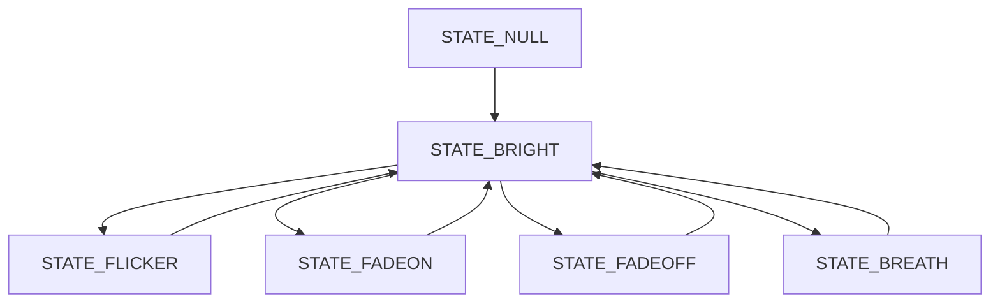
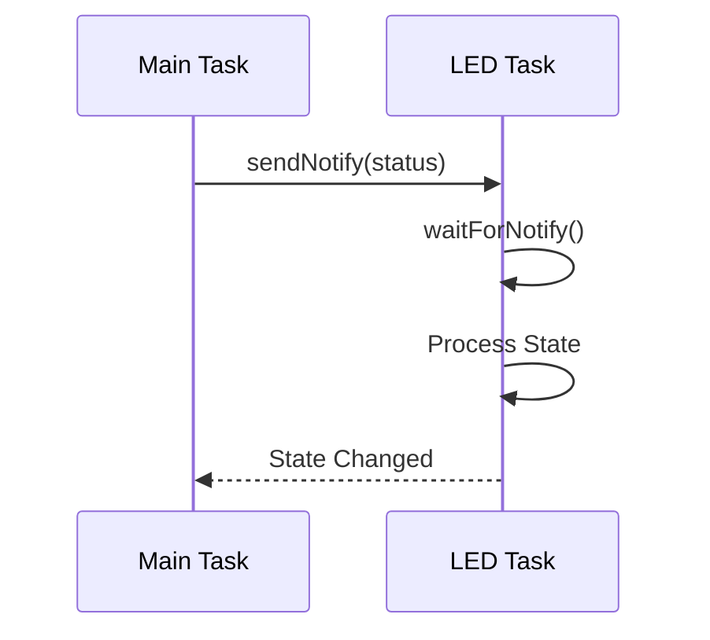

# FastDiode

## 简介

FastDiode 是一个为 ESP32 系列芯片设计的 LED 控制库，提供简单易用的 API 来实现 LED 的各种效果控制。支持 ESP32、ESP32-S2、ESP32-S3、ESP32-C3 等系列芯片。

## 特性

- 支持多个 LED 同时控制
- 自动管理 PWM 通道资源
- 丰富的灯效：
  - 开关控制
  - 亮度调节（0-255）
  - 闪烁效果（可设置次数）
  - 渐亮/渐暗效果
  - 呼吸灯效果
- 基于 FreeRTOS 任务的非阻塞控制
- 支持不同芯片的 PWM 通道数限制
- 自动错误处理和状态报告
- 支持高低电平触发

## 实现原理

### PWM 控制

- 使用 ESP32 的 LEDC 外设进行 PWM 输出
- PWM 频率默认为 5KHz，分辨率为 8 位（0-255）
- 通过改变占空比来实现亮度调节

### 通道管理

- 实现 PWMChannelManager 类管理 PWM 通道资源
- 使用静态数组记录通道使用状态
- 自动分配和释放通道，避免冲突
- 支持运行时检查可用通道数量

### 任务调度

- 每个 LED 实例创建一个独立的 FreeRTOS 任务
- 使用任务通知（Task Notification）进行状态切换
- 非阻塞设计，不影响主程序执行
- 任务优先级为 1，可根据需要调整

### 状态机

LED 控制采用状态机设计：

1. STATE_NULL: 初始状态
2. STATE_BRIGHT: 固定亮度状态
3. STATE_FLICKER: 闪烁状态
4. STATE_FADEON: 渐亮状态
5. STATE_FADEOFF: 渐暗状态
6. STATE_BREATH: 呼吸灯状态

### 内存管理

- 使用静态分配避免内存碎片
- LED 状态信息使用结构体封装
- 支持状态保存和恢复

### 状态切换机制



### 通信机制



### 内部数据流


## 安装

1. 使用 PlatformIO

   ```ini
   lib_deps =
       https://github.com/your-username/FastDiode.git
   ```

2. 手动安装
   - 下载本库到 Arduino 的库文件夹
   - 或复制到项目的 lib 目录

## 快速开始

```cpp
#include <Arduino.h>
#include "FastDiode.h"

// 创建 LED 对象
// 参数: GPIO引脚, 触发电平(false=低电平触发), LED名称
FastDiode led(12, false, "myLED");

void setup() {
    // 无需其他初始化
}

void loop() {
    led.open();               // 打开 LED
    delay(1000);

    led.setBrightness(122);   // 设置亮度为约50%
    delay(1000);

    led.flickering(500);      // 持续闪烁，间隔500ms
    delay(2000);

    led.flickering(500, 2);   // 闪烁2次后恢复之前状态
    delay(2000);

    led.fodeOn(2000);         // 2秒内渐亮到最大亮度
    delay(2000);

    led.fodeOff(2000);        // 2秒内渐暗到熄灭
    delay(2000);

    led.breathing(500);       // 呼吸灯效果，周期500ms
    delay(3000);

    led.close();              // 关闭 LED
}
```

## API 说明

### 构造函数

```cpp
FastDiode(uint8_t _pin, bool _edge = false, String _name = " ")
```

- `_pin`: LED 连接的 GPIO 引脚
- `_edge`: 触发电平，false=低电平触发，true=高电平触发
- `_name`: LED 名称（可选）

### 基本控制

- `open()` - 打开 LED
- `close()` - 关闭 LED
- `setBrightness(value)` - 设置亮度，value 范围 0-255

### 特效控制

- `flickering(time, count = MAX_COUNT, brightness = 255)`

  - 闪烁效果
  - time: 闪烁间隔(ms)
  - count: 闪烁次数，默认持续闪烁
  - brightness: 闪烁亮度，默认最大

- `fodeOn(time, brightness = 255)`

  - 渐亮效果
  - time: 渐变时间(ms)
  - brightness: 目标亮度，默认最大

- `fodeOff(time, brightness = 255)`

  - 渐暗效果
  - time: 渐变时间(ms)
  - brightness: 起始亮度，默认最大

- `breathing(time, brightness = 255)`
  - 呼吸灯效果
  - time: 呼吸周期(ms)
  - brightness: 最大亮度，默认最大

## 注意事项

1. 时间参数说明

   - 渐变效果的 time 参数不能小于 255ms
   - 建议呼吸灯的 time 参数不小于 500ms 以获得较好效果

2. 状态恢复

   - `flickering`函数在指定次数后会恢复到之前的状态
   - 其他效果会保持在最后的状态

3. 内存使用
   - 每个 LED 实例会创建一个 FreeRTOS 任务
   - 任务栈大小为 2KB

## 示例

更多示例请参考 [examples](examples/) 目录：

- [基础控制](examples/diode_example/diode_example.cpp)

## 许可证

MIT License

## 贡献

欢迎提交 Issue 和 Pull Request！

## 作者

[CHIYoooo](<https://gitee.com/chiyoooo)>)

## 进阶用法

### 组合效果

```cpp
// 实现交替闪烁
void alternateFlash(FastDiode& led1, FastDiode& led2, uint32_t time) {
    led1.flickering(time * 2, MAX_COUNT, 255);
    delay(time);
    led2.flickering(time * 2, MAX_COUNT, 255);
}

// 实现波浪效果
void waveEffect(FastDiode leds[], int count, uint32_t delay_time) {
    for(int i = 0; i < count; i++) {
        leds[i].fadeOn(500);
        delay(delay_time);
    }
}
```

### 自定义效果

```cpp
// 创建随机闪烁效果
void randomFlicker(FastDiode& led) {
    uint8_t brightness = random(50, 255);
    uint32_t duration = random(100, 1000);
    led.flickering(duration, 1, brightness);
}

// 创建渐变色效果
void gradientEffect(FastDiode& led, uint32_t time) {
    for(uint8_t i = 0; i < 255; i++) {
        led.setBrightness(i);
        delay(time/255);
    }
}
```

## 性能优化

### 内存优化

```cpp
// 减小任务栈大小
#define MINIMAL_STACK_SIZE 1024

// 使用静态分配
static FastDiode led(15);

// 共享任务栈
#define SHARED_STACK_SIZE 4096
StaticTask_t xTaskBuffer;
StackType_t xStack[SHARED_STACK_SIZE];
```

### CPU 优化

```cpp
// 降低PWM频率
#define LOW_POWER_FREQ 1000  // 1KHz

// 使用较低的任务优先级
#define LED_TASK_PRIORITY 1

// 增加任务延时
#define TASK_DELAY pdMS_TO_TICKS(2)
```

## 调试指南

### 日志输出

```cpp
// 启用调试输出
#define FAST_DIODE_DEBUG 1

// 日志级别
typedef enum {
    LOG_NONE = 0,
    LOG_ERROR,
    LOG_WARN,
    LOG_INFO,
    LOG_DEBUG
} log_level_t;

// 使用示例
#if FAST_DIODE_DEBUG
    log_i("PWM Channel: %d", pwmChannel);
    log_w("Memory Low: %d bytes", ESP.getFreeHeap());
#endif
```

### 性能监控

```cpp
// 监控CPU使用率
void printStats() {
    Serial.printf("CPU Usage: %.2f%%\n", 100.0f * (1.0f - xPortGetCPUUsage()));
    Serial.printf("Free Heap: %d bytes\n", ESP.getFreeHeap());
    Serial.printf("LED Count: %d\n", FastDiode::getInstanceCount());
}
```

## 兼容性说明

### 硬件兼容性

- ESP32 系列
  - ESP32-WROOM ✓
  - ESP32-WROVER ✓
  - ESP32-S2 ✓
  - ESP32-C3 ✓
  - ESP32-S3 ✓

### 软件兼容性

- Arduino IDE 1.8.x ✓
- Arduino IDE 2.x ✓
- PlatformIO ✓
- ESP-IDF v4.x ✓

### 依赖项

- Arduino ESP32 Core >= 2.0.0
- FreeRTOS
- ESP32 LEDC 硬件支持
