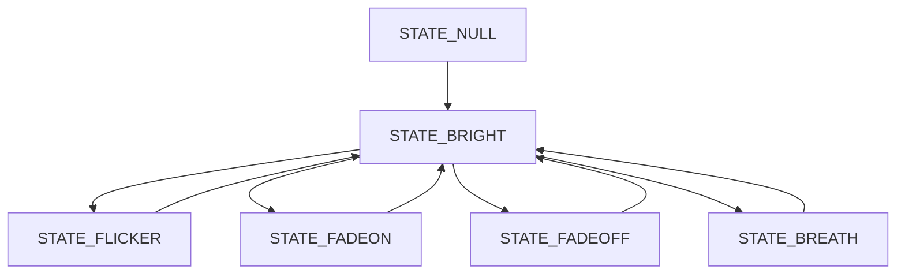
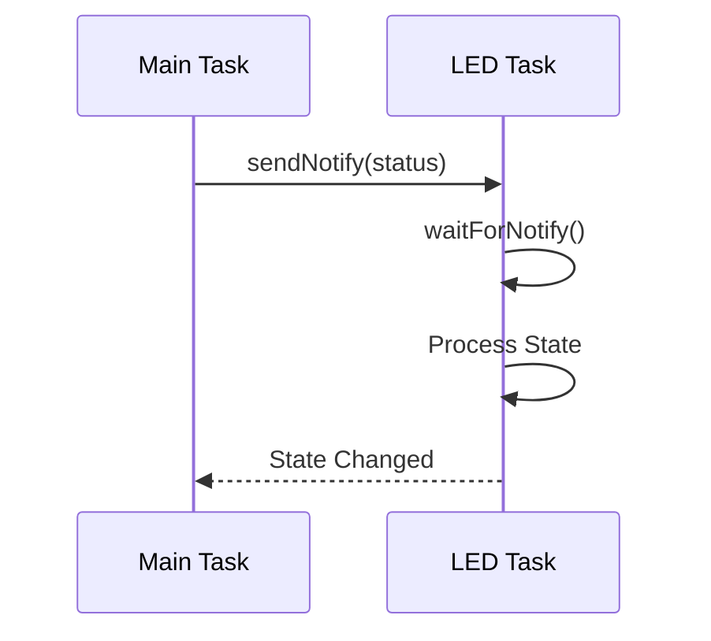

# FastDiode

## 简介

FastDiode 是一个为 ESP32 系列芯片设计的 LED 控制库，提供简单易用的 API 来实现 LED 的各种效果控制。支持 ESP32、ESP32-S2、ESP32-S3、ESP32-C3 等系列芯片。

## 特性

- 支持两种控制模式:
  - LEDC PWM 控制模式
  - 普通 GPIO (analogWrite) 控制模式
- 支持多个 LED 同时控制
- 自动管理 PWM 通道资源
- 丰富的灯效：
  - 开关控制
  - 亮度调节（0-255）
  - 闪烁效果（可设置次数和恢复，当次数为 0 时，会一直闪烁，当设定指定次数后，会恢复到之前的状态）
  - 渐亮/渐暗效果
  - 呼吸灯效果
- 基于 FreeRTOS 任务的非阻塞控制
- 支持高低电平触发（ACTIVE_HIGH/ACTIVE_LOW）
- 支持状态保存和恢复
- 错误处理和状态报告功能

## 实现原理

### PWM 控制

- 使用 ESP32 的 LEDC 外设进行 PWM 输出
- PWM 频率默认为 5KHz，分辨率为 8 位（0-255）
- 通过改变占空比来实现亮度调节

### 通道管理

- 实现 PWMChannelManager 类管理 PWM 通道资源
- 使用静态数组记录通道使用状态
- 自动分配和释放通道，避免冲突
- 支持运行时检查可用通道数量

### 任务调度

- 每个 LED 实例创建一个独立的 FreeRTOS 任务
- 使用任务通知（Task Notification）进行状态切换
- 非阻塞设计，不影响主程序执行
- 任务优先级为 1，可根据需要调整

### 状态机

LED 控制采用状态机设计：

1. STATE_NULL: 初始状态
2. STATE_BRIGHT: 固定亮度状态
3. STATE_FLICKER: 闪烁状态
4. STATE_FADEON: 渐亮状态
5. STATE_FADEOFF: 渐暗状态
6. STATE_BREATH: 呼吸灯状态

### 内存管理

- 使用静态分配避免内存碎片
- LED 状态信息使用结构体封装
- 支持状态保存和恢复

### 状态切换机制



### 通信机制



### 内部数据流


## 安装

1. 使用 PlatformIO

   ```ini
   lib_deps =
       https://github.com/chiyoooo/FastDiode.git
   ```

2. 手动安装
   - 下载本库到 Arduino 的库文件夹
   - 或复制到项目的 lib 目录

## 快速开始

### 基础示例

```cpp
#include <Arduino.h>
#include "FastDiode.h"

// 使用 LEDC PWM 方式
FastDiode led1(13, 5000, CHANNEL_0, ACTIVE_LOW, "LED1");

// 使用普通 GPIO 方式
FastDiode led2(12, ACTIVE_LOW, "LED2");

void setup() {
    Serial.begin(115200);

    // LEDC 模式需要调用 begin()
    led1.begin();

    // 设置呼吸灯效果
    led1.breathing(500);
}

void loop() {
    if(/* 某个条件 */) {
        // 基础控制
        led2.open();                    // 打开 LED
        delay(1000);

        led2.setBrightness(122);        // 设置亮度 (0-255)
        delay(1000);

        led2.flickering(500);           // 闪烁效果，间隔 500ms
        delay(2000);

        led2.fodeOn(2000);             // 2秒内渐亮
        delay(2000);

        led2.fodeOff(2000);            // 2秒内渐暗
        delay(2000);

        led2.breathing(500);            // 呼吸灯效果
        delay(2000);

        // 闪烁2次后恢复之前状态
        led2.flickering(500, 2);
    }
}
```

## API 说明

### 构造函数

1. LEDC PWM 模式:

```cpp
FastDiode(uint8_t pin, uint32_t freq, ELEDChannel channel = CHANNEL_AUTO,
         bool reverse = false, String name = "")
```

2. 普通 GPIO 模式:

```cpp
FastDiode(uint8_t pin, bool reverse = false, String name = "")
```

参数说明:

- `pin`: LED 连接的 GPIO 引脚
- `freq`: PWM 频率 (仅 LEDC 模式)
- `channel`: LEDC 通道 (仅 LEDC 模式)
- `reverse`: 触发电平 (true = ACTIVE_LOW, false = ACTIVE_HIGH)
- `name`: LED 标识名称

### 基本控制函数

- `begin()` - 初始化 LED (LEDC 模式必需)
- `open()` - 打开 LED
- `close()` - 关闭 LED
- `setBrightness(uint8_t brightness)` - 设置亮度 (0-255)

### 特效控制函数

- `flickering(uint32_t time, uint32_t count = MAX_COUNT, uint8_t brightness = 255)`

  - 闪烁效果
  - 完成指定次数后会恢复到之前的状态

- `fodeOn(uint32_t time, uint8_t brightness = 255)`

  - 渐亮效果
  - time: 渐变总时间(ms)

- `fodeOff(uint32_t time, uint8_t brightness = 255)`

  - 渐暗效果
  - time: 渐变总时间(ms)

- `breathing(uint32_t time, uint8_t brightness = 255)`
  - 呼吸灯效果
  - time: 呼吸周期(ms)

### 错误处理

```cpp
bool hasError();              // 检查是否有错误
String getLastError();        // 获取最后的错误信息
void clearError();           // 清除错误状态
```

## 通道限制

不同 ESP32 芯片支持的 LEDC 通道数:

- ESP32: 16 通道 (0-15)
- ESP32-S2/S3: 8 通道 (0-7)
- ESP32-C3: 6 通道 (0-5)

## 注意事项

1. LEDC 模式必须调用 `begin()` 进行初始化
2. 渐变效果的最小时间为 255ms
3. 使用 CHANNEL_AUTO 时会自动分配通道
4. 每个 LED 实例会创建一个 FreeRTOS 任务
5. 当指定闪缩次数，那么闪烁完成后会恢复到之前的状态。更适合指示灯的应用场合
6. 当指定闪烁次数为 MAX_COUNT（默认参数） 时会持续闪烁，直到调用其他控制函数改变状态；
7. 使用 analogWrite() 时 PWM 频率固定为 1KHz，而 LEDC 模式可以自定义 PWM 频率（如设置为 5KHz），更适合需要防止频闪的调光场合
8. 使用 LEDC 模式会自动分配 PWM 通道，当通道数超出限制时会循环使用，建议注意通道分配以避免冲突
9. LEDC 模式可以手动指定通道，也可以使用 CHANNEL_AUTO 自动分配；普通 GPIO 模式（analogWrite）会自动分配通道。建议在同一个项目中统一使用一种模式，避免通道冲突。

## 许可证

MIT License

## 作者

[CHIYoooo](https://gitee.com/chiyoooo)

## 性能优化

### 内存优化

```cpp
// 减小任务栈大小
#define MINIMAL_STACK_SIZE 1024

// 使用静态分配
static FastDiode led(15);

// 共享任务栈
#define SHARED_STACK_SIZE 4096
StaticTask_t xTaskBuffer;
StackType_t xStack[SHARED_STACK_SIZE];
```

### CPU 优化

```cpp
// 降低PWM频率
#define LOW_POWER_FREQ 1000  // 1KHz

// 使用较低的任务优先级
#define LED_TASK_PRIORITY 1

// 增加任务延时
#define TASK_DELAY pdMS_TO_TICKS(2)
```

## 调试指南

### 日志输出

```cpp
// 启用调试输出
#define FAST_DIODE_DEBUG 1
```

## 兼容性说明

### 硬件兼容性

- ESP32 系列
  - ESP32-WROOM ✓
  - ESP32-WROVER ✓
  - ESP32-S2 ✓
  - ESP32-C3 ✓
  - ESP32-S3 ✓

### 依赖项

- Arduino ESP32 Core >= 2.0.0
- FreeRTOS
- ESP32 LEDC 硬件支持
